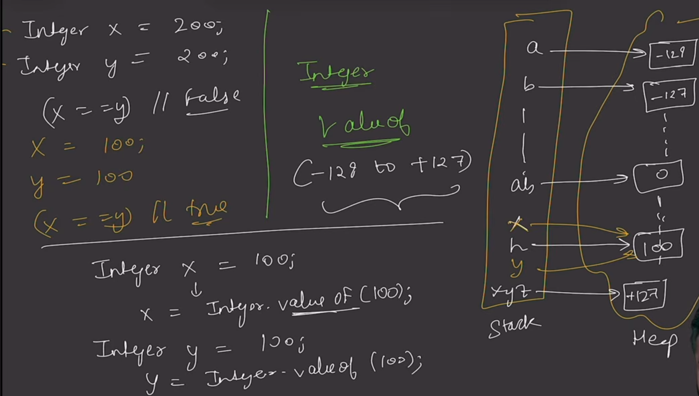
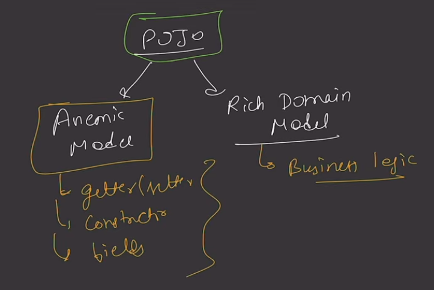

Q) Why only one public class pre file is allowed in java?
soln. JVM is outside the package and for it to run the file i.e compile and execute the class should be public , but if a file has more than one public file , it'd create ambiguity for JVM , which class to access.

Q)Why name of the public class should be same as filename?
Soln. 🔹 1. Java enforces one public class per file

If a class is declared public, it becomes globally accessible. To avoid ambiguity, Java enforces:

A .java file can contain only one public class, and the file name must match that class.

Example:

public class MyProgram {
    public static void main(String[] args) {
        System.out.println("Hello");
    }
}

✔ File name must be: MyProgram.java
❌ If you name it Test.java → compile-time error

🔹 2. Compiler (javac) mapping mechanism

The Java compiler (javac) works like this:

It reads the filename → expects a matching public class
It generates a .class file with the same name
MyProgram.java → MyProgram.class

If names don’t match, the compiler cannot reliably map:

source file → compiled bytecode
class → file system
🔹 3. Class loader dependency

At runtime, the JVM uses the class loader to load classes.

It assumes:

Class name = file name (without .java/.class)

So if you run:

java MyProgram

The JVM looks for:

MyProgram.class

If the names didn’t match, the JVM wouldn’t know where to find the class.

Wrapper class:

    int (primitive) --> Integer(Wrapper)

    int x=20;    a container is created in stack, whose name is x and value is 10
    Integer x=new Integer(20);  a container is created in heap whose value is 10 and is referenced by x in the stack

-> Collection framework only deals with classes and objects , they don't deal with primitives i.e why they need wrapper classes
-> wrapper classes have their own methods as well

Autoboxing: converts primitive to wrapper class
 int x=10;
 Integer y=x; //Autoboxing
 //Integer y =new Integer(x); (internally (old method)) (deprecated)
 //Integer y=Integer.valueOf(x); (internally (new method)) more optimized than old , b/c from inside it uses caching
 Note:- if u try to print  y, like System.out.println(y); here automatically unboxing doesn't happens,since y is an object
        we need it's value to print, like y.toString(), or even if u don't write it, by default it accesses, the method 
        and does not do the unboxing automatically.

Unboxing: converts wrapper to primitive
 Integer x=10;
 int y=x;
 // int y=x.intValue(); intvalue() won't be static , else x won't be able to access it.

Cases where autoboxing and unboxing applies:
1) Assignment (as discussed in definition)
2) Method call 
  main(){
    Integer x=50;
    printInteger(x);
  }
  void printInteger(int x){
    System.otu.prinltn(x);
  }
3. Arithmetic Operations
    Integer a=10;
    Integer b=10;
    int sum=a+b;

__Null Pointer Exception in AutoBoxing__:
Integer x= null; (can store since it's an object only)
int y=x;
System.out.println(y); //Throws Null Pointer exception .b/c primitives can't handle it 

== vs equals():
  == -> compares references
  .equals() -> compares values

_Caching Inside Integer Class_:

In Java, the Integer class employs a clever memory-optimization technique known as Integer Caching. Instead of creating a brand-new object every time you need a small number, Java reuses pre-existing objects from a "pool."

How It Works
When you use autoboxing (e.g., Integer x = 10;) or call Integer.valueOf(int), Java doesn't immediately allocate memory on the heap. Instead, it checks an internal static inner class called IntegerCache.

Default Range: By default, Java caches all integers between -128 and 127.

The Logic: If the value you're requesting falls within this range, Java returns a reference to a shared object from the cache. If it’s outside this range, it creates a new Integer object.

Why Do This?
Small integers (especially 0, 1, -1, etc.) are used incredibly frequently in loops, array indexing, and logic. Reusing these objects:

Reduces Memory Footprint: You aren't littering the heap with thousands of "1" objects.

Improves Performance: Avoiding object creation reduces the pressure on the Garbage Collector.

The "Gotcha": == vs .equals()
This caching behavior is often why junior developers run into confusing bugs. Because the cache returns the same reference for small numbers, the identity operator (==) appears to work, but it fails as soon as the numbers get larger.

Java
Integer a = 100;
Integer b = 100;
System.out.println(a == b); // true (Both point to the same cached object)

Integer c = 200;
Integer d = 200;
System.out.println(c == d); // false (Outside cache range; two distinct objects)
Pro Tip: Always use .equals() to compare the values of wrapper classes. Using == is essentially gambling on whether the value is cached or not.

Can You Change the Range?
Yes, but only the upper bound. You can't change the -128 floor, but you can increase the ceiling using a JVM argument if your application heavily uses larger numbers:

-XX:AutoBoxCacheMax=<size>

Abstract Classes:
1. Are constructors allowed?
Yes. Even though you cannot instantiate an abstract class (you can't do new MyAbstractClass()), it can still have a constructor. This constructor is called when a concrete subclass is instantiated using super(). It is typically used to initialize fields defined in the abstract class.

2. Can abstract classes be final?
No. This is a fundamental contradiction in Java.

abstract means the class must be extended to be useful.

final means the class cannot be extended.
If you try to use both, the compiler will throw an error.

3. Can abstract classes have static methods?
Yes. Static methods belong to the class itself, not to an instance. You can call a static method of an abstract class using the class name (e.g., AbstractClass.myStaticMethod()) without ever needing to create an object.

4. Can abstract classes have private methods?
Yes. Abstract classes can have private methods to provide helper logic for other methods within the same class. However, keep in mind that a private method cannot be abstract, because a private method cannot be seen (and thus cannot be overridden) by subclasses.

5. Can abstract classes have final methods?
Yes. You can define a method with a full implementation in an abstract class and mark it final. This ensures that while subclasses inherit the method, they are prohibited from overriding or changing its behavior.

6. Can abstract classes have no abstract methods?
Yes. You can declare a class as abstract even if it contains only concrete methods (or no methods at all). This is a common design pattern used when you want to prevent developers from creating instances of a class, forcing them to use a subclass instead.

_POJO classes_:

