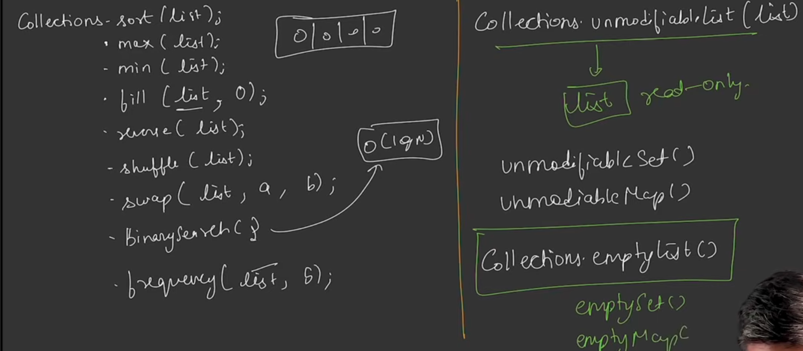

In java , we can compare primitive values, but what about objects that are created on basis of user-defined datatype.
The main problem arises when we use these user-defined datatypes in the Collection framework.
To solve this problem, we have Comparable interface
it promises a contract(that's what generally interfaces promises), that it know how to compaare one object with another of the same type
interface Comparable<T>{
    int compareTO(T o);           -->Interface thaat has only method are c/a Functional Interfaces
}
now , the one which will implement this interface will tell how it'll compare it's two value
Q)in Collections.sort(), if we are sorting a list of integers, in arraylist, so does the wrapper class, Integer, override the comparable interface??
Soln. absolutely! The Integer wrapper class explicitly implements the Comparable<Integer> interface and overrides its compareTo() method.

Here is exactly how it works and why Collections.sort() loves it:

The Integer Implementation
Because Integer implements Comparable, it is forced to provide its own implementation of the compareTo() method. This method defines the "natural ordering" for numbers (i.e., ascending order).

If you look at the actual Java source code, it looks something like this:

Java
public final class Integer extends Number implements Comparable<Integer> {
    private final int value;

    // ... constructor and other methods ...

    @Override
    public int compareTo(Integer anotherInteger) {
        // Compares two primitive int values numerically
        return Integer.compare(this.value, anotherInteger.value);
    }
}
How compareTo() Behaves
The overridden compareTo() method returns a primitive int. When Collections.sort() is running its sorting algorithm (like TimSort under the hood), it repeatedly calls this method to reorder the items in your ArrayList:

Returns a negative number (usually -1) if this integer is smaller than the other integer.

Returns 0 if both integers are equal.

Returns a positive number (usually 1) if this integer is larger than the other integer.

Quick Example:
Java
Integer num1 = 5;
Integer num2 = 10;

System.out.println(num1.compareTo(num2)); // Outputs: -1 (5 is smaller than 10)
System.out.println(num2.compareTo(num1)); // Outputs: 1  (10 is larger than 5)
Because Integer handles all of this heavy lifting internally, you get to write clean, simple code like Collections.sort(myList) without worrying about the math behind the scenes!
Q) a class student is there with student name and it's marks as the class attributes, implelment comparable interface for it?
Soln. Here is how you can implement the Comparable interface for a custom Student class.

In this example, we will sort the students by their marks in ascending order (lowest to highest). We can also leverage Integer.compare(), which connects perfectly back to what we just discussed about how wrapper classes handle comparisons!

The Student Class Implementation
Java
import java.util.ArrayList;
import java.util.Collections;
import java.util.List;

// 1. Implement Comparable and specify the type <Student>
public class Student implements Comparable<Student> {
    private String studentName;
    private int marks;

    // Constructor
    public Student(String studentName, int marks) {
        this.studentName = studentName;
        this.marks = marks;
    }

    // Getters
    public String getStudentName() {
        return studentName;
    }

    public int getMarks() {
        return marks;
    }

    // 2. Override the compareTo method
    @Override
    public int compareTo(Student otherStudent) {
        // This sorts by marks in ascending order
        return Integer.compare(this.marks, otherStudent.marks);
        
        /* 
         * TRICK: If you wanted descending order (highest marks first), 
         * you would just flip the arguments:
         * return Integer.compare(otherStudent.marks, this.marks);
         */
    }

    // Override toString() to make the output look nice when printed
    @Override
    public String toString() {
        return studentName + ": " + marks;
    }
}
Putting it Together in an ArrayList
Now, when you pass an ArrayList of Student objects to Collections.sort(), Java knows exactly what to do because you defined the rule inside the class.

Java
public class Main {
    public static void main(String[] args) {
        List<Student> students = new ArrayList<>();
        students.add(new Student("Alice", 85));
        students.add(new Student("Bob", 92));
        students.add(new Student("Charlie", 78));

        System.out.println("Before sorting:");
        System.out.println(students);

        // This works because Student implements Comparable!
        Collections.sort(students); 

        System.out.println("\nAfter sorting (by marks ascending):");
        System.out.println(students);
    }
}
Output:
Plaintext
Before sorting:
[Alice: 85, Bob: 92, Charlie: 78]

After sorting (by marks ascending):
[Charlie: 78, Alice: 85, Bob: 92]

Q)suppose student doesn't implements comparable, can we do something at Collections.sort()?
Soln.Yes, absolutely! This is exactly where the Comparator interface comes to the rescue.

If you cannot or do not want to modify the Student class to implement Comparable, you can pass an "external judge" (a Comparator) as a second argument directly inside Collections.sort().

Here are the three most common ways to do this in modern Java.

1. The Modern Way: Using Lambda Expressions
If you are using Java 8 or newer, you can pass a lambda expression directly into Collections.sort(). It takes two student objects (s1 and s2) and compares them.

Java
// Sort by marks (ascending) using a Lambda
Collections.sort(students, (s1, s2) -> Integer.compare(s1.getMarks(), s2.getMarks()));
If you want to sort by marks in descending order, you just swap s1 and s2:

Java
// Sort by marks (descending)
Collections.sort(students, (s1, s2) -> Integer.compare(s2.getMarks(), s1.getMarks()));
2. The Cleanest Way: Using Comparator.comparingInt
Java provides built-in helper methods in the Comparator interface that make the code incredibly readable using method references (Student::getMarks).

Java
import java.util.Comparator;

// Sort by marks ascending
Collections.sort(students, Comparator.comparingInt(Student::getMarks));

// Sort by marks descending
Collections.sort(students, Comparator.comparingInt(Student::getMarks).reversed());
This reads almost like plain English: "Sort students by comparing their primitive int marks."

3. The Old-School Way: Anonymous Inner Class
If you are working on a very old legacy codebase (Java 7 or older), you might see it written like this. It does the exact same thing as the lambda approach, but it is much more verbose:

Java
Collections.sort(students, new Comparator<Student>() {
    @Override
    public int compare(Student s1, Student s2) {
        return Integer.compare(s1.getMarks(), s2.getMarks());
    }
});
Bonus: A Quick Shortcut
In modern Java, you don't even technically need Collections.sort() anymore. List has its own built-in .sort() method that accepts a comparator directly:

Java
students.sort(Comparator.comparingInt(Student::getMarks));

_Dangers of 0 return_:
Using comparabel, when compareTo() returns 0, that means java treat both the object, as equals
There are some data structures, like TreeSet and TreeMap, which internally uses compareTo()
and when o return case occurs, there is chance of data loss, if either of one enters frst the second won't be allowed to enter, because they donn't allow duplicates.
It's responsiblity of programmer , if a.compareTo(b)==0, make sure that a.equals(b)-> true, (also), b/c java is going to treat those 2 objects as same after 0 return, so if both their values are same , even on is discarded in treeset or treemap, there is no data loss
When to use comparable:
what natural ordering sounds obvious for custom class
and where it's not we use comparator
